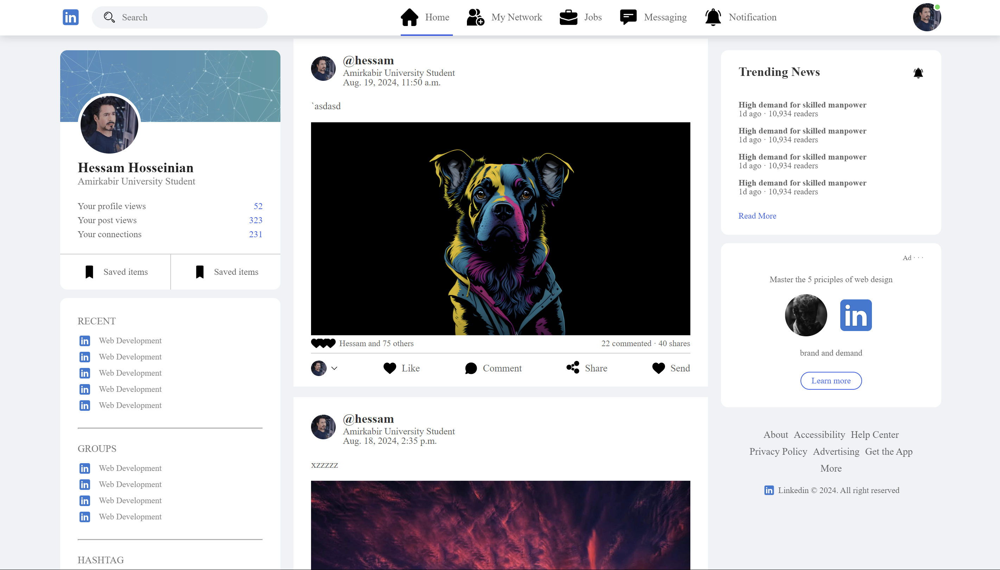
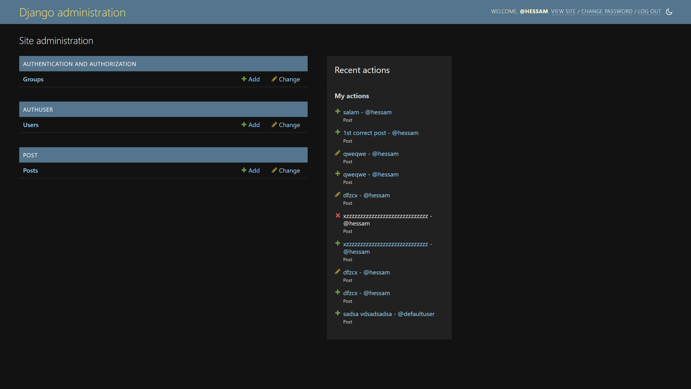

# LinkedIn Clone — Django

An in-progress **LinkedIn-style web application** built with Django as a learning project.

The repository focuses on authentication, profiles, a basic feed, and post-related functionality while leaving several social-network features for future development.

## Current status

### Implemented / partially implemented

- User sign up, login, and logout
- Basic user profiles
- Home/feed structure
- Django admin integration
- Post application and related templates/static assets
- Screenshot examples in `screenshots/`

### Planned / incomplete

- More complete post creation and interaction flows
- Profile improvements
- Connection requests and network building
- Messaging
- Job posting and job search
- Likes, comments, and sharing
- General UI/static-file cleanup

> This repository is a **work in progress**. Some pages or static assets may be incomplete.

## Tech stack

- Python
- Django
- Django Templates
- HTML / CSS
- Bootstrap
- SQLite for local development

## Repository structure

```text
.
├── manage.py
├── linkedin/       # Django project configuration
├── authuser/       # Authentication / user-related app
├── post/           # Post-related app
├── templates/
├── static/
├── screenshots/
└── requirement.txt
```

## Getting started

### 1. Clone the repository

```bash
git clone https://github.com/Hessam-Hosseinian/django-linkedin.git
cd django-linkedin
```

### 2. Create and activate a virtual environment

```bash
python -m venv .venv
```

Linux/macOS:

```bash
source .venv/bin/activate
```

Windows:

```powershell
.venv\Scripts\activate
```

### 3. Install dependencies

The repository currently uses the singular filename `requirement.txt`:

```bash
pip install -r requirement.txt
```

### 4. Apply migrations

```bash
python manage.py migrate
```

### 5. Create an admin user

```bash
python manage.py createsuperuser
```

### 6. Start the development server

```bash
python manage.py runserver
```

Open:

```text
http://127.0.0.1:8000/
```

## Screenshots

### Main page



### Django admin



## Contributing

This is primarily a learning/portfolio repository, but pull requests and suggestions are welcome.

1. Fork the repository.
2. Create a feature branch.
3. Make and test your changes.
4. Open a pull request with a short description of the change.

## License

No open-source license is currently provided.
